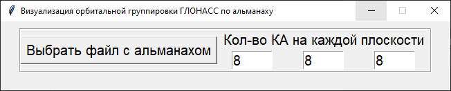
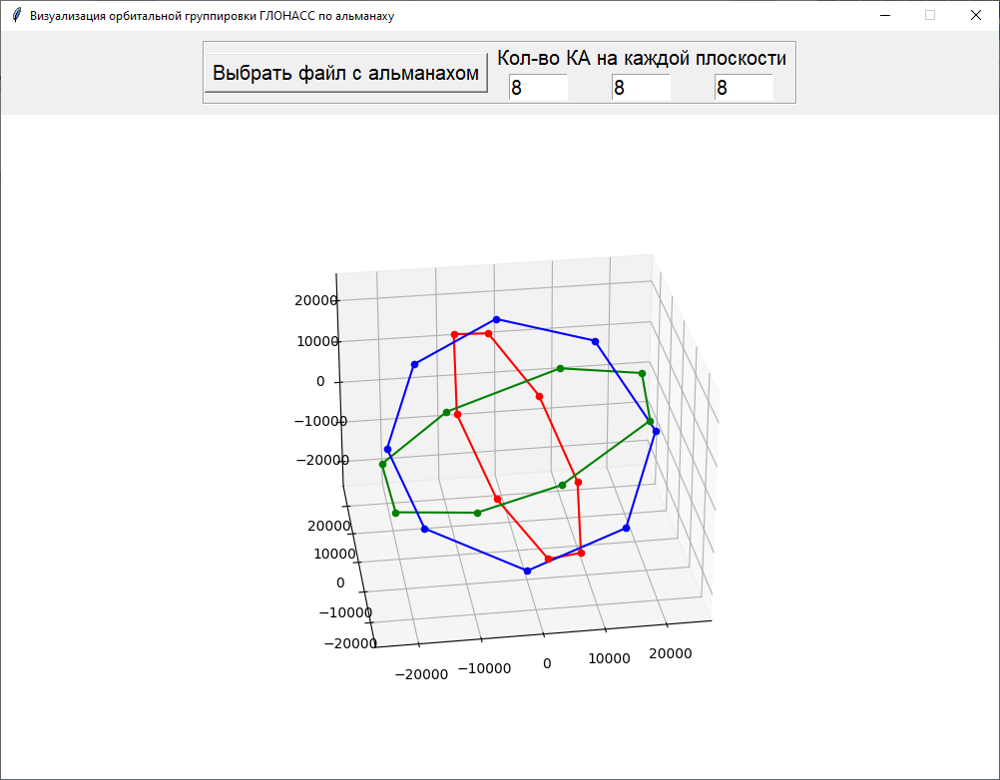

# Программа визуализации орбитальной группировки

Для запуска приложения необходимо установить зависимости 

`pip install ./requirements/base.txt`

## Окно GUI при запуске приложения 

## Построенный график с орбитальной группировкой

## Структура файла с альманахом

Первая строка в файле имеет следующие параметры:
1. Время начала моделирования (для данной программы не используется. Может быть равен 0)
2. Время окончания моделирования (для данной программы не используется. Может быть равен 0)
3. День, на которой сформирован альманах
4. Месяц, на которой сформирован альманах
5. Год, на которой сформирован альманах
6. Количество дней с начала четырехлетнего периода (с начала высокосного года)
7. Количество КА в альманахе
8. 0 - не используемый параметр
9. 0 - не используемый параметр
   
В следующих строках описан сам альманах для каждого КА. Одна строка = 1 КА. Описание элементов в строке с альманахом следующее:
1. Литера
2. Время восходящего узла в сек.
3. Расхождение ШВ в сек.
4. Долгота восходящего узла в циклах
5. Поправка к сред. значению наклонения орбиты НКА в циклах
6. Аргумент Перигея в циклах
7. Эксцентриситета в циклах
8. Поправка к среднему значению драконического периода обращения
9. Половинными скоростями изменения драконического периода

